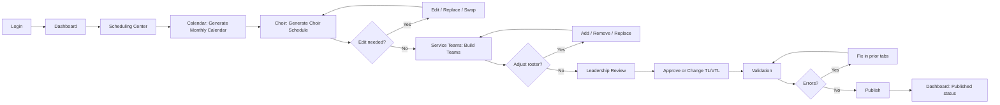
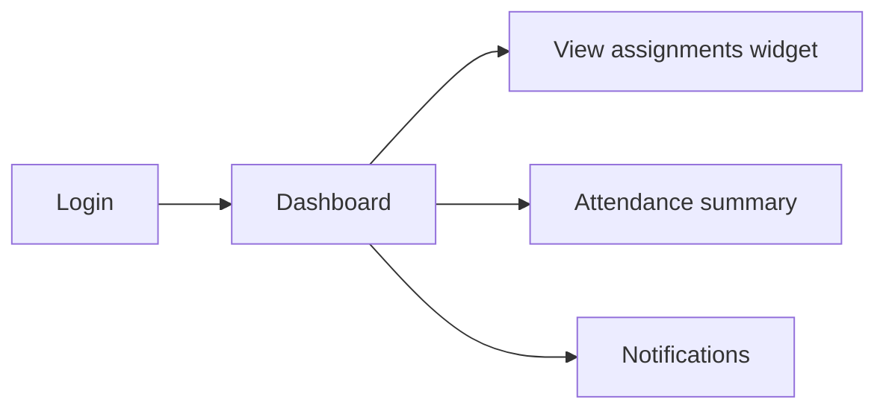
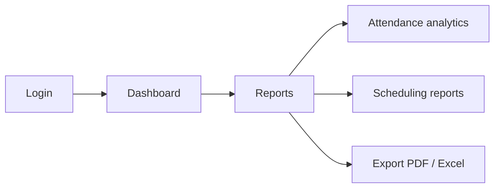

# PMSS User Flows

## Roles

| Role | Primary goals |
|------|----------------|
| President | Oversight, reports, analytics |
| Vice President | Same as President (delegated) |
| Secretary | Members, records, reports |
| Treasurer | Reports (attendance/participation) |
| **Coordinator** | **Scheduling end-to-end (primary power user)** |
| Member | View assignments, attendance, notifications |
| Team Leader / Vice TL | Per-service (temporary), shown in scheduling |

---

## Flow A — Coordinator (automation-first)

**Click budget target**: Login → Publish in ≤ 12 primary clicks when no edits (Generate × 3, tab navigations, Approve, Publish).

---

## Flow B — Member

No write access to scheduling unless role elevation.

---

## Flow C — President

---

## Mobile navigation map

| Tab | Route | Screen |
|-----|-------|--------|
| Home | `/` | Dashboard |
| Members | `/members` | Member list |
| Schedule | `/scheduling` | Scheduling Center (default Calendar) |
| Reports | `/reports` | Reports |
| More | `/settings` | Settings + Attendance entry |

Attendance recording: Dashboard quick link or More menu → `/attendance/record`.

---

## Scheduling Center tab order (fixed)

1. Calendar → 2. Choir → 3. Service Teams → 4. Leadership Review → 5. Validation → 6. Publish → 7. History

Prototype: horizontal tabs desktop; scrollable chips mobile.
